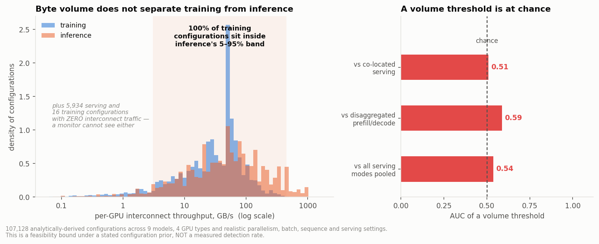
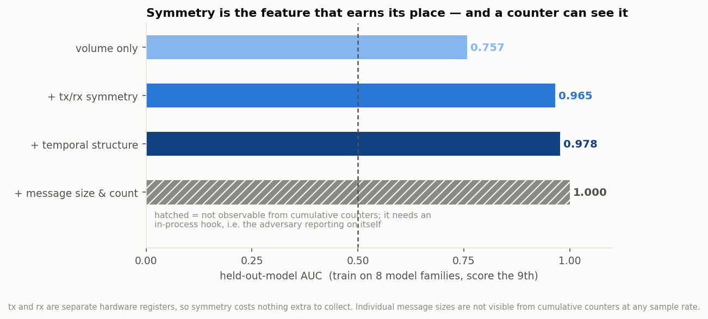
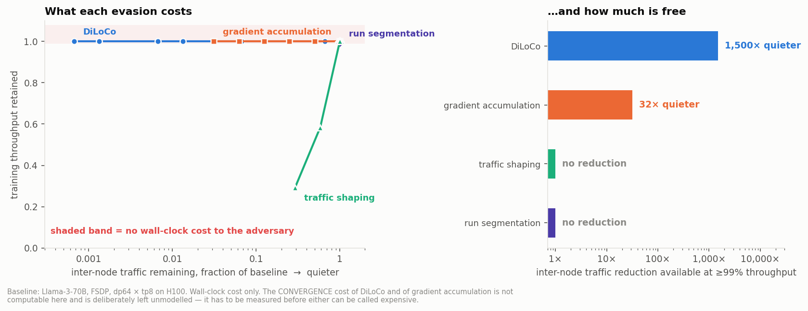

# Does interconnect traffic separate training from inference?

**The Week-4 gate, answered analytically in week 1.**
Parsa Salimi, SPAR F26. September 2026.

Written assuming no background. If a term isn't defined here, that's a bug —
tell me.

---

## 0. Why this question, and why it can be answered now

Our project proposes to detect large-scale model training by watching **how much
data moves between GPUs**, rather than by watching the GPUs themselves. Two
fabrics carry that data:

- **NVLink** — the high-speed links between the 8 GPUs inside one server. On an
  H100 node, 450 GB/s per GPU in each direction.
- **The NIC** (InfiniBand or Ethernet) — the network between servers. On the same
  machine, 50 GB/s per GPU. **Nine times slower**, which is why anything
  bandwidth-hungry is arranged to stay inside a node.

The project plan puts an early-stopping gate at week 4: if training and inference
turn out not to be separable on communication, we pivot to writing up a negative
result. That gate was scheduled to depend on cluster data we don't have yet — and
the fabric between our two current nodes is still an open question.

But a large part of it doesn't need data at all. The number of bytes a training
step moves is **arithmetic**, fixed by the parallelism strategy, the model shape
and the numeric precision. Same for inference. So I built the arithmetic, swept
107,128 realistic configurations, and measured how much the two classes overlap.

**Headline: they overlap almost completely.** A threshold on interconnect volume
separates training from co-located LLM serving with AUC **0.51** — chance is 0.50.
Volume is not the signal. But two structural properties are, one of which is free
to collect, and that shapes what the collection agent must record.

---

## 1. What the model is

Not a simulator. Closed-form formulas, one per communication pattern, with a
hardware model for how long a step takes.

### The formula everything rests on

When N GPUs must agree on a sum — which is what gradient synchronisation is —
they run a **ring all-reduce**. Each GPU sends its slice around the ring,
accumulating, then the result is passed back around. The bytes each GPU actually
puts on the wire are

> **2 × (N−1)/N × M**   where M is the size of the buffer being summed

Not `2M`. At N=2 the factor is exactly **1.0**, so the common shorthand
over-counts a two-GPU run by a factor of two. (Long's `nccl_hook` uses `* 2`; at
world_size=2 his byte counts are 2× high.)

### Training, per GPU per step

Write Ψ for the parameter count, *b* for bytes per number (2 for bf16), *L* for
layers, *H* for hidden size, *B* for batch, *S* for sequence length.

| strategy | what moves | bytes per GPU per step |
|---|---|---|
| **DDP** (data parallel) | one all-reduce of the gradients | 2(N−1)/N · Ψ·b → **2Ψb** |
| **FSDP / ZeRO-3** | all-gather params forward, all-gather backward, reduce-scatter gradients | **3Ψb** — exactly 1.5× DDP, but as many small bursts rather than one spike |
| **Tensor parallel** | 4 all-reduces *per layer* (2 forward, 2 backward), each the size of an activation tensor | 4L · 2(T−1)/T · B·S·H·b |
| **Pipeline parallel** | activations handed stage to stage, point-to-point | 2·B·S·H·b — small, bursty, and **one-directional** |
| **MoE** | 2 all-to-alls per expert layer (dispatch, combine) | 2·L<sub>moe</sub>·(N−1)/N·B·S·k·H·b |

Concretely, Llama-2-7B in bf16 under DDP moves **26.9 GB per GPU per step**.
Under tensor parallelism at batch 8, sequence 2048: **128 collectives of 134 MB
each**, 17.2 GB of buffers, 30.1 GB actually on the wire at 8-way TP.

### Inference

The quantity that matters is the **KV cache** — the per-token state a language
model keeps so it doesn't recompute the whole prompt for every new token:

> KV bytes per token = 2 (K and V) × L × n_kv_heads × d_head × b

For Llama-2-7B, which gives every attention head its own key/value, that's
**512 KiB per token**. For Llama-3-8B, which shares key/value across groups of
heads (grouped-query attention), it's **128 KiB** — a 4× reduction, and the
single biggest lever on inference communication.

In **disaggregated serving**, the fashionable deployment, the prompt is processed
on one set of GPUs and tokens are generated on another, so the whole prompt's KV
cache is pushed across the NIC once per request. At 25 requests/second with
2048-token prompts on Llama-2-7B that's **26.8 GB/s**.

Compare: 7B DDP training sustains about 25 GB/s. **This is the problem in one
line.** Two completely different activities, the same bytes per second.

### How long a step takes

Volume alone isn't observable — a monitor sees a *rate*. So each configuration
needs a step time:

```
t = max( compute_time, intra_bytes / NVLink_bandwidth, inter_bytes / NIC_bandwidth )
```

compute_time comes from FLOPs (6Ψ per token for forward+backward, 8Ψ with
activation checkpointing) divided by the cluster's peak throughput times an
achieved-utilisation factor. The `max` matters: a step cannot be shorter than the
time its own traffic needs on the wire. **33.9% of the training configurations in
the grid turn out to be communication-bound**, waiting on the network rather than
computing. That has consequences in §5.

---

## 2. Verification

Twenty assertions pin the model to numbers derivable by hand, so a later edit that
breaks the arithmetic fails loudly. All pass. Among them:

- ring factor = 1.0 at N=2, 1.75 at N=8, → 2 for large N
- DDP 7B bf16 = 26.9 GB/step/GPU
- FSDP / DDP = exactly 1.5 in bytes per step
- TP at 7B/batch 8/seq 2048 = 128 collectives × 134.2 MB
- KV per token = 512 KiB (MHA) vs 128 KiB (GQA), a 4× ratio
- NVLink : NIC = 9 : 1 per GPU
- DiLoCo at H=500 cuts sync volume by exactly 500×
- co-located tensor-parallel **inference** is symmetric; pipeline **training** is
  directional — so symmetry is not a disguised class label (see §3a)

---

## 3. Three mistakes I made, because they are the interesting part

### (a) I nearly proved my own assumption

The first version attached a "cadence regularity" and a "symmetry" number to each
workload *by class* — training got 0.03, inference got 0.05 and 1.0. Any
classifier fed those features separates the classes perfectly, because I had
already separated them by hand. The first run duly returned **AUC 1.000**, which
is not a result, it's a mirror.

The fix was to attach those properties to the **mechanism** instead. A ring
all-reduce is symmetric because of what a ring all-reduce *is*; a KV-cache push is
one-directional because it goes from the prefill node to the decode node. Then the
aggregate properties of a workload fall out of which mechanisms it happens to
contain — and they genuinely cross-cut the classes, which is what makes a result
from them meaningful.

### (b) I reported throughputs that cannot physically exist

Before the bandwidth clamp, the grid contained inference configurations at
**716 GB/s per GPU** on hardware whose NVLink tops out at 450. Adding the `max()`
above fixed it and, as a side effect, produced the most interesting result in §5:
when a run is already waiting on the network, an evasion that makes it quieter
also makes it **faster**.

### (c) The grid was answering questions about itself

Two artifacts, both mine:

- Every inference configuration was single-node, so "inter-node traffic implies
  training" was true by construction. Fixed by adding pipeline-parallel and
  cross-node expert-parallel serving, which are real deployments.
- No single-GPU training configuration was *feasible* at the batch sizes I'd
  swept, so "zero traffic implies inference" was also true by construction. Fixed
  by adding small batches — single-GPU LoRA fine-tuning is real, and it is
  genuinely invisible to interconnect monitoring. That's a scope limit we should
  state, not an artifact to hide.

---

## 4. Results

### 4.1 Volume does not separate the classes



| comparison | AUC of a volume threshold |
|---|---:|
| training vs co-located serving | **0.510** |
| training vs disaggregated prefill/decode | 0.588 |
| training vs all serving modes pooled | 0.538 |

AUC is the probability that a randomly chosen training configuration has more
traffic than a randomly chosen inference one. 0.5 is a coin flip. **100% of
training configurations sit inside the 5th–95th percentile band of inference.**

Worse than uninformative: when a simple model is fitted on eight model families
and asked to score the ninth, a single volume feature scores **0.433** — below
0.5, meaning the threshold that works at 7B points the *wrong way* at 70B. Volume
doesn't even have a stable direction across scales.

### 4.2 But symmetry does separate them — and a counter can see it



Held-out-model AUC (train on 8 model families, score the 9th — the same
discipline as the power analysis, so nothing can memorise a specific model):

| features | AUC |
|---|---:|
| volume, split by fabric | 0.757 |
| **+ tx/rx symmetry** | **0.965** |
| + temporal structure of the rate | 0.978 |
| + individual message sizes and collective counts | 1.000 |

The jump from 0.757 to 0.965 comes from one feature: **does this traffic send as
much as it receives?** Gradient synchronisation does, because a reduction is
symmetric by construction. A KV-cache push doesn't — it flows one way. And
crucially, **transmit and receive are separate hardware registers**, so symmetry
costs nothing extra to collect.

The last row is the trap. Message size is the strongest feature of all — and it is
**not observable from cumulative byte counters at any sample rate**. A counter
tells you how many bytes have crossed, never in what sized pieces. Getting message
sizes needs an in-process hook — which is exactly the adversary reporting on
itself, and therefore not something a verifier can rely on. It is drawn hatched
for that reason, and it must stay out of the feature set.

### 4.3 The blind spot

Both single-GPU training and replicated serving — one whole model per GPU, the
common way to serve small models — emit **zero interconnect traffic**. They are
indistinguishable, and not because our detector is weak. There is nothing to see.
This is a scope limit on the whole approach and belongs in the report's threat
model, not in a footnote.

### 4.4 Three of the four evasions are free



Baseline: Llama-3-70B, FSDP, 64-way data parallel × 8-way tensor parallel on H100.
80 GB/s per GPU, of which 77 is NVLink and only 3.3 crosses the NIC — 17% of
NVLink capacity and 7% of the NIC's.

| evasion | inter-node traffic reduction at ≥99% throughput | wall-clock cost |
|---|---:|---|
| **DiLoCo** (sync every H steps) | **1,500×** | none |
| **gradient accumulation** | 32× | none |
| traffic shaping | none | bites only below ~10% of link |
| run segmentation | none | 0.9% at 32 restarts |

Two things follow.

**Traffic shaping and run segmentation are not evasions against a volume
detector — they're free but they don't buy quiet.** Shaping only costs anything
once the cap drops below about 10% of the link, because this workload was only
using 17% to begin with. Segmentation doesn't change per-step traffic at all; it
moves the run *boundary*, which is a threshold-reporting evasion, not a telemetry
one.

**DiLoCo is the dangerous one.** It cuts inter-node traffic by three orders of
magnitude at no wall-clock cost, and in the communication-bound regime it is
actively **2.89× faster** than the baseline it escapes — the run had been waiting
on the network and now it isn't. A negative-cost evasion is the worst case for
any detection scheme.

Its only real price is a **convergence** penalty: more local steps between syncs
means a worse update. That is not computable from this model, and I have
deliberately left it blank rather than guess. Until someone measures it, **we
cannot claim this evasion is costly**, and any claim we make about catching it has
to carry that caveat.

---

## 5. What this means for the project

1. **The gate passes, conditionally.** Not on volume — that route is closed, and
   we now know it before spending cluster time. It passes on structure, chiefly
   symmetry.
2. **This fixes the trace schema**, which was the open design question. The agent
   must record **transmit and receive separately, per link, at a few Hz** — not a
   single aggregate byte count. Symmetry is where the signal lives, it is free,
   and a schema that sums tx and rx into one number throws it away permanently.
3. **Don't build a volume detector**, and be suspicious of any feature we can't
   get from a counter. If a result depends on message sizes, it depends on the
   adversary's cooperation.
4. **Measure DiLoCo's convergence penalty early.** It is the evasion most likely
   to defeat us and the one whose cost we currently cannot state.
5. **State the blind spot up front.** Single-GPU training and replicated serving
   are invisible. Our claim is about *distributed* training, and the report should
   say so in the threat model rather than have a reviewer find it.
6. **A useful by-product:** the model produces exact per-flow byte counts for any
   configuration, which is the ground truth a synthetic trace generator needs. The
   next deliverable can be built directly on this.

---

## 6. The caveat that governs everything above

**This is an analytic grid, not a sample of the world.** Every AUC here is a
property of the configuration prior I encoded — how many training configs, how
many serving configs, at what scales — and is **a feasibility bound, not a
detection rate**. It answers "could a perfect observer of these quantities tell
them apart?" It does not answer "what will our detector score on real traffic?"

The power analysis is the reason to be careful about this. There, a number that
looked like 0.99 became 0.52 once the evaluation respected the real unit of
replication. I've applied the same held-out-model discipline here, which is why
§4.2 holds out whole model families rather than individual configurations. But
the deeper lesson transfers: **a clean number on data you designed is not
evidence.** These figures are for choosing what to build and what to collect.
They are not results to report as detection performance.

Other limits: real MFU varies more than the 0.45 assumed; overlap between compute
and communication is modelled as perfect, which flatters throughput and therefore
understates communication-bound cases; collectives are assumed ring-based, and
NCCL uses tree algorithms for small messages; and the inference throughput model
is memory-bandwidth-bound decode, which ignores prefill contention under
continuous batching.

---

## Appendix: glossary

Every term this document uses, in the order it becomes relevant.

**Parameter (Ψ)** — a single learned number in the model. "7B" means 7 billion of
them. **bf16 / fp16 / fp8** — how many bytes each one occupies: 2, 2 and 1.

**Step** — one pass of forward computation, backward computation and a weight
update, over one batch of data. Training is millions of these.

**Collective** — an operation every GPU in a group takes part in together.
- **all-reduce**: everyone contributes a buffer, everyone ends up with the sum.
  This is how gradients get averaged. Symmetric: each GPU sends about what it
  receives.
- **all-gather**: everyone contributes a slice, everyone ends up with all slices.
- **reduce-scatter**: everyone contributes a full buffer, each ends up with the
  summed version of only their own slice. all-reduce = reduce-scatter + all-gather.
- **all-to-all**: every GPU sends a different piece to every other GPU. Used to
  route tokens to experts in a mixture-of-experts model.
- **point-to-point (p2p)**: one GPU sends to one other. One-directional.

**DDP — Distributed Data Parallel.** Every GPU holds a complete copy of the model;
the batch is split between them; one all-reduce per step averages the gradients.
Cheap in bytes (2Ψb per GPU per step), but every GPU needs room for the whole
model plus its optimizer state — about 16 bytes per parameter under mixed-precision
Adam, which is 1.1 TB for a 70B model. So DDP alone cannot train large models.

**FSDP — Fully Sharded Data Parallel** (PyTorch's name for ZeRO-3). Same idea, but
parameters, gradients and optimizer state are each split across the GPUs, so no
GPU holds the whole model. The price is fetching what you don't own: all-gather
the parameters in the forward pass, all-gather them again in the backward pass,
reduce-scatter the gradients. Three passes rather than two — **exactly 1.5× DDP's
bytes** — and, importantly for detection, delivered as many small per-layer bursts
rather than one large spike per step.

**Tensor parallel (TP)** — split each individual weight matrix across GPUs, so
every GPU does part of every layer. Needs 4 all-reduces per layer per step, each
the size of an activation tensor. Bandwidth-hungry, so it is kept inside one node.

**Pipeline parallel (PP)** — put different layers on different GPUs and pass
activations along the chain. Cheap and point-to-point, therefore directional.

**MoE — mixture of experts.** Only a fraction of the parameters is used for any
given token. Cheap to compute, expensive to communicate: two all-to-alls per
expert layer.

**MFU — model FLOP utilisation.** What fraction of the hardware's peak arithmetic
rate a real run achieves. 0.4–0.5 is normal for well-tuned training.

**Activation checkpointing** — discard intermediate activations in the forward
pass and recompute them in the backward pass. Trades ~33% more compute for much
less memory.

**KV cache** — the per-token key/value state a language model keeps so that
generating token *n+1* doesn't require reprocessing tokens 1…*n*. Its size per
token is the dominant term in inference memory and inter-node traffic.

**GQA — grouped-query attention.** Several attention heads share one key/value
head, shrinking the KV cache several-fold. Llama-2-7B (no GQA): 512 KiB per token.
Llama-3-8B (8-way GQA): 128 KiB.

**Prefill / decode** — prefill processes the whole prompt at once (compute-bound);
decode generates one token at a time (memory-bandwidth-bound). **Disaggregated
serving** runs them on separate GPUs, which means the prompt's KV cache must be
pushed across the network once per request.

**DiLoCo** — a low-communication training method: each worker takes H local steps
and the workers synchronise only once per H. Cuts data-parallel traffic by a
factor of H.

**AUC** — the probability that a randomly chosen positive example scores higher
than a randomly chosen negative one. 1.0 is perfect, 0.5 is a coin flip, and below
0.5 means the score points the wrong way.

---

## 7. Files

```
analysis/comm_model/
  README.md            this document
  commvol.py           the model: collectives, hardware, models, training, inference
  test_commvol.py      20 anchor assertions against hand-derived numbers
  sweep.py             the 107,128-configuration grid and the separability measures
  evasions.py          evasion cost curves
  figures_comm.py      the three figures
  grid.csv.gz          every configuration with its derived traffic profile
  separability.json    the headline AUCs
  evasion_cost.csv     volume reduction and throughput cost per evasion
  figures/             c1 overlap, c2 feature tiers, c3 evasion cost
```

Run `python3 test_commvol.py` first. If the anchors don't pass, nothing else here
means anything.
