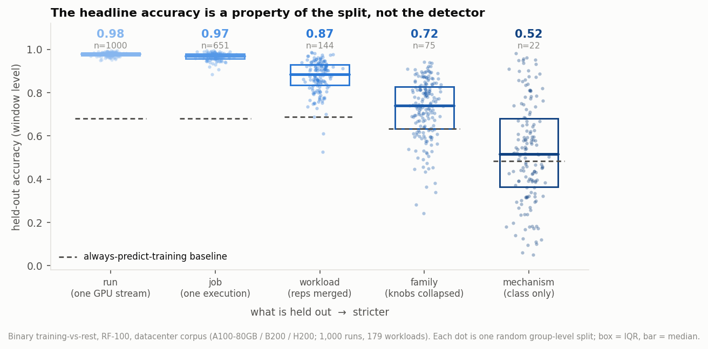
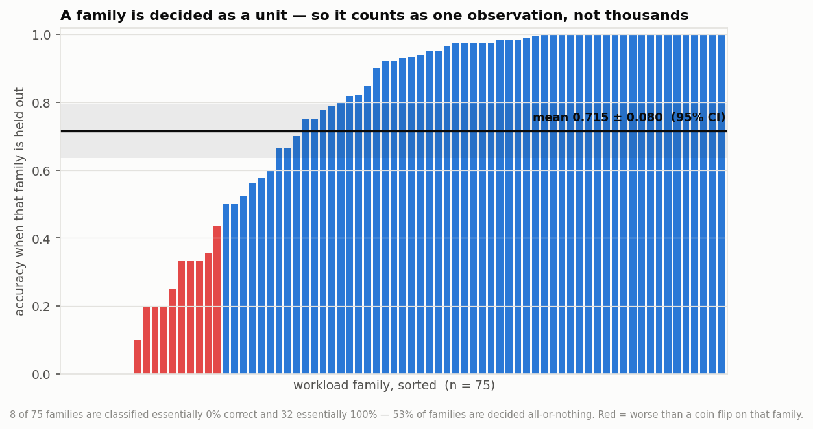
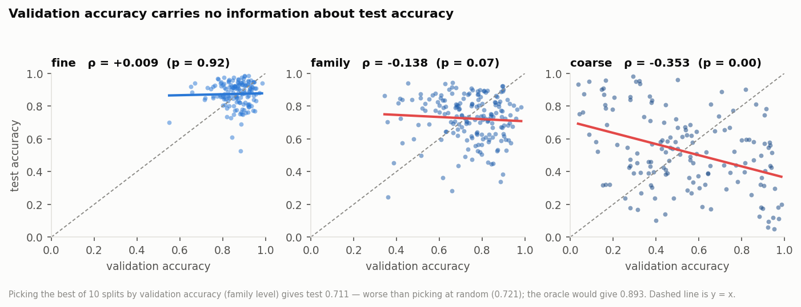
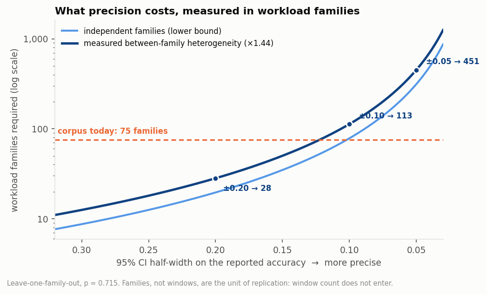

# How many workloads does a detection claim need?

**Parsa Salimi — SPAR F26, interconnect monitoring project. Draft, September 2026.**
*Status: for team review. Nothing here is committed to `main`.*

---

## Summary

Every accuracy number this project has produced so far is reported over **windows**.
Windows are not independent observations. Within a run they are near-identical
(the repo's own estimate is ICC(1) ≈ 0.98); across runs, the workload sweeps are
knob settings on the same mechanism rather than different workloads. The unit of
statistical replication is the **workload family**, and there are 75 of them in the
datacenter corpus — 22 if you group by mechanism.

Re-running the binary training-vs-rest classifier on that corpus, changing nothing
but what is held out:

| what is held out | groups | accuracy | sd across splits | trivial baseline | beats baseline |
|---|---:|---:|---:|---:|---:|
| nothing (random windows) | — | **0.991** | — | 0.68 | — |
| run (one GPU stream) — *the paper's protocol* | 1,000 | 0.977 | 0.010 | 0.681 | 100% |
| job (one physical execution) | 651 | 0.966 | 0.018 | 0.680 | 100% |
| workload label (reps merged) | 144 | 0.874 | 0.075 | 0.687 | 100% |
| **workload family (knobs collapsed)** | **75** | **0.724** | **0.139** | 0.634 | **73%** |
| mechanism class | 22 | 0.523 | 0.231 | 0.483 | 65% |

The headline 98% is not a property of the detector. It is a property of the split.

The estimate this corpus can actually support is **leave-one-family-out: 0.715 ± 0.080**
(95% CI, n = 75 families). At the mechanism level it is **0.520 ± 0.150** (n = 22) —
statistically indistinguishable from a coin flip, and *below* the 0.68 rate of a
classifier that ignores its input and always says "training".

Three consequences, then the collection budget.

---

## 1. Why windows are not observations

The formula for the standard error of a proportion is SE = √(p(1−p)/n). Everything
turns on what counts in n.

Two things collapse it:

**Within a run.** Consecutive 30 s windows of the same 8-hour run share memory
footprint, clock behaviour, power envelope and periodic structure. The repo's
`rebuttal_analysis/README.md` measures ICC(1) ≈ 0.98, flat from 30 s to 4 h of
separation — an 8 h run at 1 Hz carries roughly 1.3 windows' worth of independent
information, not 28,800.

**Across runs.** `adversarial_L_diluted_2 / _5 / _10 / _20` is one dilution knob
turned four times. `fsdp_7b / 13b / 30b / 70b` is one FSDP scale ladder. A detector
that generalises to one setting generalises trivially to the rest. Grouping these
properly takes 179 workload labels down to 75 families.

Figure 4 shows the mechanism directly: when a family is held out, **53% of families
are classified all-or-nothing** — essentially 0% or essentially 100% correct. The
detector does not degrade gracefully across a family's windows; it decides the
family as a unit. That is what it means for a family to be one observation.



---

## 2. What the corpus actually supports

Leave-one-family-out, every family held out exactly once:

| estimator | n | accuracy | 95% CI |
|---|---:|---:|---:|
| family-level LOFO (unweighted family mean) | 75 | **0.715** | ± 0.080 |
| family-level LOFO (window-weighted) | 75 | 0.784 | — |
| mechanism-level LOFO | 22 | **0.520** | ± 0.150 |

The CI comes from the measured spread of per-family accuracies, divided by √n — no
distributional assumption.

**The failures are not symmetric, and they point the wrong way for a monitor.**
At family level, held-out *training* families score 0.829 but held-out
*non-training* families score 0.577. At mechanism level:

| held-out mechanism | class | accuracy |
|---|---|---:|
| `other.sweep`, `other.mining` | not-training | 0.00 |
| **`infer.llm`** | not-training | **0.067** |
| `infer.vision` | not-training | 0.102 |
| `evade.symgemm-control` | not-training | 0.137 |
| `train.lora-finetune` | training | 0.284 |
| `train.fsdp` | training | 0.577 |
| `evade.dilution` | training | 0.961 |
| `train.ddp` | training | 0.978 |

Held out entirely, **93% of LLM inference windows are called training**. This is the
false-positive rate that matters for a governance instrument, and it is invisible in
any evaluation that lets some LLM inference into the training set. The converse also
holds: 72% of LoRA fine-tuning is missed when no LoRA is in training.



---

## 3. Model selection on validation is not possible here

Across repeated family-level splits, the rank correlation between validation and
test accuracy is **ρ = −0.138** (p = 0.066); at mechanism level **ρ = −0.353**
(p < 10⁻⁴). Not merely uninformative — mildly *anti*-correlated.

Concretely: pick the best of 10 splits by validation accuracy and the test accuracy
you get is **0.711**, against **0.721** for picking at random and 0.893 for an
oracle. Selecting on validation is worse than not selecting.

This is an arithmetic consequence of §1, not a quirk. A validation split holds ~15
families; at p ≈ 0.72 its own standard error is ~0.12. You cannot rank models with a
ruler whose graduations are wider than the differences you are trying to measure.
It also explains the previously-noted result that selection on validation *degraded*
held-out accuracy — that was not a bug to be found.



---

## 4. The collection budget

Observed between-split variance is 1.44× what independent Bernoulli families would
give (the effective number of independent families in a 15-family test split is
10.4). Folding that in, at p = 0.715:

| target 95% CI half-width | families required |
|---|---:|
| ± 0.20 | 28 |
| ± 0.15 | ~52 |
| ± 0.10 | 113 |
| ± 0.05 | 451 |

We have 75. That buys roughly **± 0.12**.

These are still optimistic: they treat every new family as a fresh draw from the same
population, and the per-family accuracies in Figure 4 are far from homogeneous.

**The operational point:** precision is bought with *families*, never with hours. The
next section shows this is not a modelling assumption but a measured fact.



---

## 5. Verification — more windows buy nothing

The analysis keeps at most 10 evenly-spaced windows per run. If that cap were doing
the work, the result would be an artefact. Re-running the identical splits (same
seeds) at three caps:

| windows per run | total windows | mean accuracy | sd across splits |
|---|---:|---:|---:|
| 3 | 2,612 | 0.748 | 0.134 |
| 10 | 8,046 | 0.736 | 0.146 |
| 30 | 18,694 | 0.727 | 0.160 |

**A 7.2× increase in windows does not reduce the spread at all** — it rises slightly.
If windows were observations, the sd would have fallen by a factor of √7.2 ≈ 2.7.
This is the claim of §1, measured rather than argued.

---

## 6. What this means for the interconnect project

1. **Report intervals, not point estimates.** Any detection or false-positive rate we
   publish should carry a family-level CI. In a compute-governance context the number
   will be read as an input to a feasibility argument; ±0.12 changes what it can
   support. An honest 0.72 ± 0.12 is worth more than a fragile 0.98.
2. **Fix the evaluation protocol before collecting.** Leave-one-family-out, negatives
   chosen at matched scale, and — for evasions — leave-one-strategy-out with the
   evasion *never* in the training set. The existing
   `classifier/leave_one_strategy_out.py` is the right shape; it needs the family
   grouping underneath it.
3. **The collection target is families, not GPU-hours.** For the interconnect corpus
   this means many distinct parallelism strategies, model scales, batch regimes,
   fabrics and inference serving patterns — and it means resisting the temptation to
   run the same DDP job for longer. 28 families gets us ±0.20; ~113 gets us ±0.10.
   That is a number to take to the November cluster allocation.
4. **Inference must be represented properly before any of this means anything.** The
   worst held-out mechanism is LLM inference, at 0.067. On the interconnect side the
   corresponding hazard is sharper: inference workloads with no KV cache produce no
   KV-cache transfers, so the single most important inference *communication* pattern
   would be absent from the corpus entirely. A detector never shown that traffic will
   call it training.
5. **Expect the interconnect numbers to start worse, not better.** This analysis is on
   nine mature on-GPU NVML signals. Our signal has never been successfully collected
   once.

---

## 7. Limitations

- **The family map is a judgement call.** `families.py` states every rule and the
  full mapping is dumped for review. The three-level ladder (144 / 75 / 22) exists so
  the conclusion can be checked against where the line is drawn: the direction is the
  same at every level, only the magnitude moves.
- **One corpus, one classifier.** Datacenter GPUs (A100-80GB / B200 / H200), binary
  training-vs-rest, RF-100. The consumer-GPU and AMD subsets are excluded; the
  grouping argument applies to them unchanged but the numbers would differ.
- **Windows are capped at 10 per run** (see §5 for why this is safe).
- **Class balance is 68% training**, so raw accuracy flatters the detector. Baselines
  are reported alongside every number for this reason; balanced accuracy and per-class
  rates are the better primary metric and should replace accuracy in the report.
- **LOFO trains on 74 of 75 families each time**, so it slightly over-states what a
  detector trained on a *smaller* corpus would achieve.

---

## 8. Reproducing

```
python3 inventory.py                  # corpus census -> inventory.csv
python3 extract.py <a> <b>            # window features for files [a,b) -> win_a_b.parquet
python3 power.py <level> <reps> <seed>  # repeated grouped splits -> reps_<level>.csv
python3 lofo.py family 0 75           # leave-one-family-out -> lofo_family.csv
python3 analyse.py                    # summary statistics -> summary.csv
python3 figures.py                    # figures + headline_numbers.json
python3 sensitivity.py <cap> <reps>   # window-cap sensitivity
```

Two notes for anyone re-running this:

- `fastwin.py` reproduces `threeway_improved.sliding_windows(..., run_level_mode="causal")`
  **bit-for-bit** (verified: max absolute difference 0.0 over all numeric feature columns)
  but is O(n) rather than O(n²) in run length. The repo version re-slices the whole run
  with a boolean mask for every window, which is why the 8-hour runs are slow.
- Do not cast the window timestamp columns to float32. Epoch seconds are ~1.79 × 10⁹,
  where float32 has ~128 s of resolution; the cast silently collapses distinct windows
  onto the same timestamp. (Found the hard way.)
